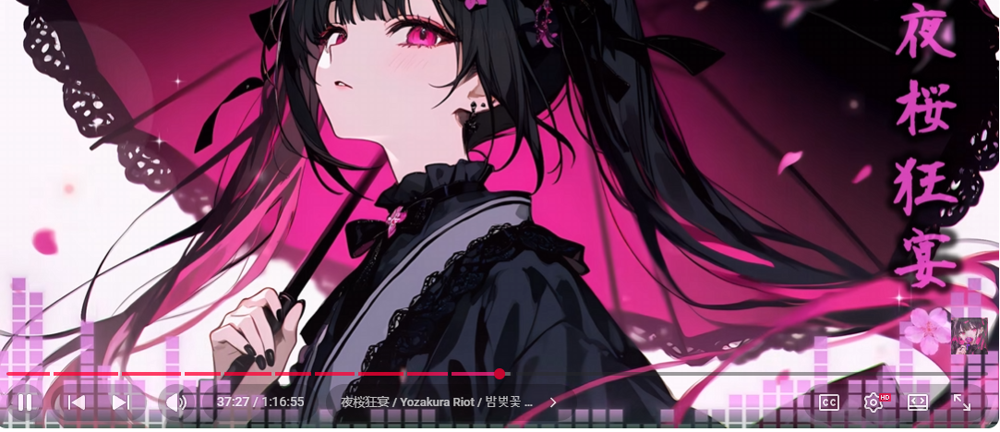

# AMV Maker

Generate anime music videos in the style of [Poisonpop Candy](https://www.youtube.com/channel/UC8qGpw8GUxcQZftXQeFavXw) — a static or animated anime image composited with an audio-reactive visualizer, decorative particles, and rainfall effects, rendered to MP4.



## Features

### Visualizer Types

- **Bar Graph** — Stacked semi-transparent boxes that build up and collapse with audio amplitude. Each bar is composed of individual boxes with visible gaps between them, matching the Poisonpop Candy aesthetic.
- **Oscilloscope** — Waveform trace drawn across the bottom of the frame with a multi-layer glow effect.
- **Radial** — Frequency bars arranged in a circle that pulse outward with the music.
- **Particle** — Energy-reactive particles that spawn on beats, affected by gravity and decay.

### Animation Layers

- **Cherry Blossom Petals** — Configurable number of petal particles (0-100) that drift across the frame with randomized size, speed, and transparency.
- **Rainfall** — Configurable number of raindrops (0-500) that fall with varying speed and slight horizontal drift. Set to 0 to disable.

### GUI Application

- **File pickers** for image (PNG/JPG/BMP) and audio (MP3/WAV/AAC/OGG/FLAC)
- **Image thumbnail preview** after selection
- **Visualizer dropdown** to choose between all four visualizer types
- **Configurable settings** — bar count, petal count, rainfall count, duration limit, output path
- **Determinate progress bar** with percentage display during rendering
- **Background rendering** — GUI stays responsive while encoding
- **Embedded video player** with Play/Pause/Stop, seek slider, and time display
- **FPS counter** overlay in the top-left corner during playback

### Video Player

- Synced audio-video playback using audio as the master clock
- Optimized for 30+ FPS using OpenCV for frame decoding and cv2 resize
- Persistent canvas items to avoid per-frame widget recreation
- Throttled UI updates for seek slider and time label

### CLI

Full command-line interface for scripted or headless rendering.

### Audio Analysis

- Mel-scaled spectrogram with dB scaling for perceptually balanced frequency bars
- Per-frame amplitude extraction synced to the video frame rate

## Requirements

- Python 3.12+
- FFmpeg (must be on PATH or bundled via imageio-ffmpeg)

### Python Dependencies

- moviepy
- Pillow
- numpy
- soundfile
- librosa
- opencv-python
- pygame

## Installation

```bash
git clone https://github.com/beknar/amv-maker.git
cd amv-maker
python -m venv venv

# Windows
venv\Scripts\activate.bat

# macOS/Linux
source venv/bin/activate

pip install -r requirements.txt
```

## Usage

### GUI

```bash
python gui.py
```

1. Select an image and audio file using the Browse buttons.
2. Choose a visualizer type and adjust settings (bars, petals, rainfall, duration).
3. Set the output file path.
4. Click **Render** and watch the progress bar.
5. When complete, the video auto-loads into the built-in player — press Play to preview.

### CLI

```bash
python render.py --image image.png --audio track.mp3 -o output.mp4
```

#### CLI Options

| Flag | Default | Description |
|------|---------|-------------|
| `--image` | (required) | Path to background image |
| `--audio` | (required) | Path to audio file |
| `-o, --output` | `output.mp4` | Output video path |
| `--visualizer` | `Bar Graph` | One of: `Bar Graph`, `Oscilloscope`, `Radial`, `Particle` |
| `--bars` | `40` | Number of frequency bars |
| `--petals` | `25` | Number of petal particles (0 to disable) |
| `--raindrops` | `0` | Number of raindrops (0 to disable) |
| `--duration` | full track | Limit output to N seconds |

#### Examples

```bash
# Bar graph with rainfall
python render.py --image image.png --audio track.mp3 --raindrops 150 -o rain.mp4

# Oscilloscope, no petals, 30 second clip
python render.py --image image.png --audio track.mp3 --visualizer Oscilloscope --petals 0 --duration 30

# Radial visualizer with heavy rain and petals
python render.py --image image.png --audio track.mp3 --visualizer Radial --raindrops 300 --petals 50
```

## Output

- Format: MP4 (H.264 video, AAC audio)
- Resolution: 1280x800
- Frame rate: 30 FPS

## Project Structure

```
amv-maker/
  gui.py             # tkinter GUI application
  player.py          # Embedded video player (OpenCV + pygame)
  render.py          # Rendering engine and CLI
  requirements.txt   # Python dependencies
  CLAUDE.md          # Project context for Claude Code
  PROPOSAL.md        # Original project proposal
  image.png          # Reference screenshot
```
